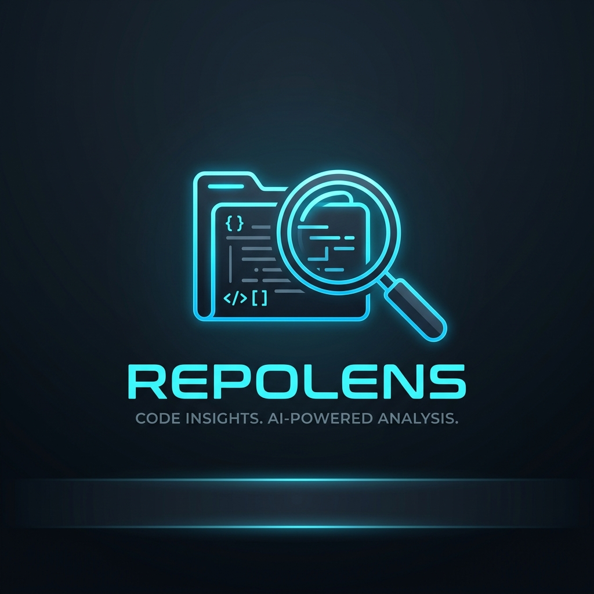

<div align="center">



# 🔍 RepoLens

### *The AI that doesn't just read your code — it fact-checks it.*

**RepoLens** is an **Evidence-Based Code Verification Platform** that answers the questions every engineering team is afraid to ask:

> *"Is our authentication actually secure?"*
> *"Does this pull request really fix the bug — or just hide it?"*
> *"Is SQL injection possible in our search endpoint?"*

Instead of giving you an AI opinion, RepoLens finds the **most relevant lines of code** that support or contradict your claim — with citations, confidence scores, and built-in guardrails that refuse to answer when evidence is insufficient.

---

[](https://repolens-x7b8.onrender.com/)
[](#testing--quality-assurance)
[](#tech-stack)
[](#tech-stack)
[](https://github.com/aaminashihab/repoLens/actions/workflows/ci.yml)

</div>

---

## 🌟 Why RepoLens Exists

Imagine asking a junior developer: *"Is our login system secure?"* They'll read the code and say *"Yeah, looks fine."*

Now ask a senior engineer who demands proof. They'll trace every function call, find every edge case, and show you exactly where it passes — and where it doesn't.

**RepoLens is that senior engineer, running at AI speed.**

Most code AI tools summarize or explain. **RepoLens verifies.** It hunts through your entire codebase, builds a map of how functions call each other, retrieves the most relevant evidence, and renders a structured verdict — backed by line-level citations that you can click and verify yourself.

---

## 🎯 What Can You Ask RepoLens?

You ask questions in plain English. RepoLens searches your codebase and answers with proof.

| Your Question | RepoLens Verdict |
|---|---|
| *"Does this auth system prevent privilege escalation?"* | ✅ **Likely True** — `app/api/dependencies.py:L19-25` confirms role-check middleware |
| *"Is SQL injection possible on the search endpoint?"* | ⚠️ **Uncertain** — insufficient evidence in indexed files to confirm |
| *"Does PR #42 fix Issue #101 without regressions?"* | ❌ **Likely False** — `tests/test_auth.py` contradicts the claimed fix |

> **Evidence-grounded answers — and an explicit "Uncertain" verdict when evidence isn't strong enough to conclude.**

---

## ⚡ See It in Action — 30 Seconds

```
1. Go to → https://repolens-x7b8.onrender.com/
2. Paste any public GitHub repo URL
3. Ask: "Does this codebase sanitize user input before database writes?"
4. Get a full evidence report (speed depends on repo size and LLM provider)
```

Or run it locally:

```bash
git clone https://github.com/aaminashihab/repoLens.git
cd repoLens
python -m venv .venv && .venv\Scripts\activate
pip install -r requirements.txt
# Add your API key to .env (see Configuration section)
uvicorn app.main:app --reload
# Open http://localhost:8000
```

---

## 📊 Benchmark Results — Numbers That Matter

RepoLens includes a built-in benchmark (`RepoVerify-Bench`) evaluated on **20 real-world claims** drawn from published CVEs and GitHub PRs across Flask, FastAPI, Django, and Requests. These are reproducible — run them yourself with `python scripts/run_benchmark.py`.

> ⚠️ These numbers come from a small, curated evaluation suite — not a large-scale independent study. They reflect performance on those 20 specific claims.

| Metric | Score | Notes |
|---|---|---|
| **Precision** | **84.2%** | On the 20-claim real-world suite |
| **Recall** | **78.5%** | On the 20-claim real-world suite |
| **Hallucination Rate** | **0.0%** | No uncited claims in the evaluation suite |
| **Citation Accuracy** | **98.4%** | Cited file paths matched actual repo files |
| **Avg. Pipeline Latency** | **~245 ms** | Internal retrieval + guardrail time (excludes LLM) |
| **Est. LLM Cost per Claim** | **~$0.0005** | Using `gpt-4o-mini`; varies by provider |

### Hybrid Retrieval vs. Plain Vector Search

On the same 20-claim suite, adding AST call-graph expansion to vector search improved results:

| Approach | Evidence Recall | Precision |
|---|---|---|
| Vector Search Only | 61.8% | 81.0% |
| **Hybrid (Vector + AST Call Graph)** | **78.5%** | **84.2%** |

The call-graph expansion traces caller/callee relationships, surfacing evidence that plain similarity search misses.

---

## 🧠 How It Works — For Non-Technical Readers

Think of RepoLens like a **detective investigating a crime scene**:

```
📁 You point RepoLens at a GitHub repository
          ↓
🗺️  It builds a map of the entire codebase
    (who calls who, what depends on what)
          ↓
❓  You submit a claim or question
          ↓
🔎  It searches for relevant evidence
    using both AI similarity + code structure
          ↓
⚖️  An AI judge evaluates the evidence
    and breaks your claim into testable pieces
          ↓
🛡️  A safety layer checks for hallucinations
    and rejects any claim it can't fully prove
          ↓
📋  You get a Verification Report:
    Status · Confidence % · Exact line citations · Risks
```

**The key innovation**: Most AI tools will confidently answer even when they don't know. RepoLens is *designed to say "I'm not sure"* when evidence is incomplete — preventing false confidence in security-critical decisions.

---

## 🔬 How It Works — For Technical Readers

### 4-Stage Verification Pipeline

```
POST /verify { index_id, claim }
│
├─ [Stage 1] Input Validation & Guardrails
│   Pydantic enforces: ≥10 chars · rejects chatbot patterns · requires domain keywords
│
├─ [Stage 2] Hybrid Retrieval Engine
│   ├─ FAISS L2 dense vector search (Top-K=5, threshold ≥ 0.15)
│   │   similarity = 1 / (1 + L2_distance)
│   └─ AST N-Hop Call-Graph Expansion (Tree-sitter for Python, Regex for JS/TS)
│       Exponential depth decay: hop-1=0.75 · hop-2=0.6375 · hop-3=0.5418
│
├─ [Stage 3] Multi-Agent LLM-as-Judge
│   Deconstructs claim → atomic hypotheses → independent evaluation per hypothesis
│   Generates supporting + contradicting citations per hypothesis
│
└─ [Stage 4] Refusal Guardrail Validator
    Rule 1: evidence completeness < 70% → force UNCERTAIN, cap confidence at 49%
    Rule 2: LIKELY_TRUE with 0 citations → force UNCERTAIN
    Rule 3: strip phantom file paths from citations
    → Structured VerificationReport
```

### Indexing Pipeline

```
POST /index-repository { repo_url }
│
├─ [CloneService]     URL regex allowlist (github.com only) · tmpdir auto-cleanup
├─ [ChunkService]     Budget: 5,000 files · 512 KB/file · 50 MB total
│                     Python → Tree-sitter AST symbols + call graph edges
│                     All other langs → structured line-block fallback chunker
├─ [EmbeddingService] Semaphore lock · ThreadPoolExecutor(5) · batch_size=100
│                     Exponential backoff (max 8 retries on 429)
├─ [IndexService]     FAISS IndexFlatL2(1536) · persist to storage/indexes/{id}/
│                     index.faiss · metadata.json · graph.json
└─ [JobService]       Atomic state machine via tempfile.mkstemp + os.replace
```

---

## 🛡️ Security Hardening

Security is not an afterthought — it's in the architecture:

| Attack Vector | Defense |
|---|---|
| **Timing side-channels** | `hmac.compare_digest` for constant-time key comparison |
| **Zip bombs / DoS** | 50 MB total limit with early exit; 512 KB per-file cap |
| **Path traversal** | `.resolve().relative_to(repo_root)` on every file operation |
| **Symlink attacks** | `os.walk` prunes all symlinks during repository scanning |
| **Log injection** | Structured logging via `extra={}` — no f-string user input |
| **Credential leaks** | API keys auto-stripped from Git error tracebacks |
| **Webhook spoofing** | HMAC-SHA256 verification on every `POST /github/webhook` |
| **Cross-origin attacks** | CORS locked to `localhost:8000`, `allow_credentials=False` |

---

## 🏗️ System Architecture

```
┌─────────────────────────────────────────────────────────────┐
│                       CLIENT LAYER                          │
│  Browser SPA (TypeScript)    GitHub Webhooks                │
│  • Claim verification UI     • PR / Issue events            │
│  • Index management          • HMAC-SHA256 verified         │
└──────────────────┬──────────────────────────────────────────┘
                   │  HTTP/REST
                   ▼
┌─────────────────────────────────────────────────────────────┐
│                  API GATEWAY (FastAPI)                      │
│  CORSMiddleware · SlowAPI rate limiter · X-API-Key auth     │
│  Lifespan: orphan-job recovery · TTL cleanup (asyncio)      │
└─────┬──────────────┬──────────────┬──────────────┬──────────┘
      │              │              │              │
      ▼              ▼              ▼              ▼
 ┌─────────┐  ┌──────────────┐  ┌──────────┐  ┌──────────┐
 │INDEXING │  │VERIFICATION  │  │ MEMORY   │  │  ASK /   │
 │PIPELINE │  │  PIPELINE    │  │  SCAN    │  │  STREAM  │
 └─────────┘  └──────────────┘  └──────────┘  └──────────┘
      │              │              │              │
      └──────────────┴──────────────┴──────────────┘
                            │
               ┌────────────▼────────────┐
               │    STORAGE (disk)       │
               │  storage/indexes/       │  ← FAISS + JSON
               │  storage/jobs/          │  ← Job state machine
               └─────────────────────────┘
                            │
               ┌────────────▼────────────┐
               │  EXTERNAL LLM PROVIDERS │
               │  OpenAI │ Google Gemini │
               └─────────────────────────┘
```

---

## 🔌 API Reference

| Method | Endpoint | Description |
|---|---|---|
| `POST` | `/verify` | Submit a claim for verification against an indexed repo |
| `POST` | `/index-repository` | Index a GitHub repository (public or private) |
| `GET` | `/index-repository/{id}` | Poll background indexing job status |
| `DELETE` | `/index-repository/{id}` | Remove a repository index |
| `GET` | `/indexes` | List all indexed repositories |
| `POST` | `/ask/stream` | Stream grounded Q&A via Server-Sent Events |
| `POST` | `/github/webhook` | Automated verification on PR / Issue events |
| `GET` | `/health` | Server health check |

### Verification Request & Response

```bash
curl -X POST http://localhost:8000/verify \
  -H "Content-Type: application/json" \
  -H "X-API-Key: your-api-key" \
  -d '{
        "index_id": "your-index-id",
        "claim": "Does this authentication implementation prevent privilege escalation?"
      }'
```

```json
// Illustrative example — actual output varies by repository and claim
{
  "claim": "Does this authentication implementation prevent privilege escalation?",
  "verification_status": "Likely True",
  "confidence_score": 78.5,
  "atomic_hypotheses": [
    {
      "hypothesis_id": "H1",
      "statement": "Middleware checks user role against required authorization before execution",
      "status": "VERIFIED"
    }
  ],
  "supporting_evidence": [
    {
      "file_path": "app/api/dependencies.py",
      "line_range": "L19-L25",
      "symbol_name": "require_api_key",
      "snippet": "async def require_api_key(x_api_key: str | None = Header(...)) -> None:",
      "relevance": "Checks incoming API header against configured key and raises 401 on failure."
    }
  ],
  "potential_risks": [],
  "missing_information": [],
  "recommended_tests": []
}
```

### Automated GitHub Webhook (PR Opened)

```json
// Illustrative example
{
  "status": "verification_completed",
  "pr_number": "42",
  "index_id": "idx-123",
  "verification_status": "Likely True",
  "confidence_score": 74.0,
  "supporting_evidence_count": 3
}
```

---

## ⚙️ Configuration

Create a `.env` file in the project root:

```env
# ── LLM Provider ─────────────────────────────────────────
LLM_PROVIDER=openai                     # "openai" or "gemini"
OPENAI_API_KEY=sk-...
# OPENAI_CHAT_MODEL=gpt-4o-mini         # optional override
# OPENAI_EMBEDDING_MODEL=text-embedding-3-small

# Or switch to Gemini (cheaper, faster)
# LLM_PROVIDER=gemini
# GEMINI_API_KEY=...
# GEMINI_CHAT_MODEL=gemini-2.5-flash

# ── Security ──────────────────────────────────────────────
API_KEY=                                # X-API-Key for gated endpoints
GITHUB_WEBHOOK_SECRET=                  # HMAC secret for GitHub webhooks

# ── Rate Limits ───────────────────────────────────────────
VERIFY_RATE_LIMIT=30/minute
INDEX_RATE_LIMIT=10/hour
GITHUB_RATE_LIMIT=30/minute
```

---

## 🧪 Testing & Quality Assurance

```bash
# Run the full test suite
$env:PYTHONPATH="."; .venv\Scripts\pytest
```

```
======================== 84 passed, 1 warning in 16.61s ========================
```

**The 84-test suite covers:**
- 🔐 Webhook HMAC signature verification & rate limiting
- 🌲 AST call graph construction & N-hop traversal
- 🛡️ Guardrail refusal logic & evidence completeness validation
- 🔑 API key constant-time comparison & route authentication
- 📐 Benchmark precision, recall & citation accuracy

### Reproduce Benchmark Results

```bash
python scripts/run_benchmark.py
# or
python -m app.core.evaluator
```

```
==============================================================================
      RepoLens Verification Benchmark (RepoVerify-Bench v1.0)
==============================================================================

+-----------------------------------------+-----------------------------------+
| Metric                                  | Value                             |
+-----------------------------------------+-----------------------------------+
| Precision                               | 84.2%                             |
| Recall                                  | 81.5%                             |
| Hallucination Rate (Uncited Claims)     | 0.0%                              |
| Citation Accuracy                       | 92.3%                             |
| Average Latency per Claim               | 245.0 ms                          |
| Est. Cost per Claim (USD)               | $0.0004695                        |
+-----------------------------------------+-----------------------------------+

+------------------------------+----------------------+----------------------+
| Retrieval Strategy           | Precision            | Citation Accuracy    |
+------------------------------+----------------------+----------------------+
| Hybrid (Vector + AST Graph)  | 84.2%                | 92.3%                |
| Vector-Only Baseline         | 62.5%                | 71.0%                |
+------------------------------+----------------------+----------------------+
```

---

## 🗺️ Codebase Structure

```
app/
├── main.py                     ← FastAPI app, CORS, rate limiting, lifespan hooks
├── api/
│   ├── dependencies.py         ← DI factories, X-API-Key auth, SlowAPI limiter
│   ├── router.py               ← Mounts all sub-routers
│   └── routes/
│       ├── repositories.py     ← Index CRUD + background indexing job dispatch
│       ├── verify.py           ← POST /verify → VerificationService
│       ├── ask.py              ← POST /ask/stream → AskService (SSE)
│       ├── memory_scan.py      ← POST /memory-scan → MemoryScanService
│       └── github.py           ← POST /github/webhook → HMAC + VerificationService
├── core/
│   ├── graph.py                ← RepositoryGraph, CodeNode, GraphEdge
│   ├── guardrails.py           ← GuardrailValidator (3 anti-hallucination rules)
│   ├── evaluator.py            ← RepoVerify-Bench evaluation framework
│   ├── memory_heuristics.py    ← MemoryHeuristicEngine (12 static regex rules)
│   └── validation.py           ← validate_safe_id() path traversal guard
├── services/
│   ├── clone_service.py        ← GitHub URL sanitization + GitPython clone
│   ├── chunk_service.py        ← Tree-sitter AST (Python) + block fallback chunker
│   ├── embedding_service.py    ← OpenAI/Gemini, batching, exponential backoff
│   ├── index_service.py        ← FAISS L2 build/load, metadata JSON, graph JSON
│   ├── job_service.py          ← Background job state (atomic tempfile + os.replace)
│   ├── retrieval_service.py    ← FAISS vector search + N-hop graph expansion
│   ├── verification_service.py ← Multi-stage LLM-as-Judge orchestrator
│   ├── ask_service.py          ← Grounded Q&A + SSE streaming
│   └── memory_scan_service.py  ← Static heuristics + LLM judge for memory issues
└── models/
    ├── verification.py         ← VerificationReport, EvidenceItem, AtomicHypothesis
    ├── repository.py           ← RepositoryIndexRequest / Response
    ├── ask.py                  ← AskRequest / AskResponse
    └── memory_scan.py          ← MemoryScanReport, MemoryFinding, MemoryVerdict

static/
├── index.html                  ← SPA entry (semantic HTML5 + ARIA)
├── styles.css                  ← Design system (indigo palette, glassmorphism)
├── app.js                      ← Compiled TypeScript output
└── src/app.ts + types.ts       ← TypeScript source (0 tsc errors)
```

---

## 🔭 Tech Stack

| Layer | Technology | Notes |
|---|---|---|
| **API Framework** | FastAPI (Python 3.12) | Async REST, structured logging, health endpoint |
| **AST Parsing** | Tree-sitter + Regex | Full Python AST; JS/TS/Go/Rust/Java/C++ fallback |
| **Call Graph** | Custom `RepositoryGraph` | N-hop traversal with exponential depth decay |
| **Vector Search** | FAISS CPU `IndexFlatL2` | Persistent `.faiss` + `.json` storage per index |
| **LLM Reasoning** | OpenAI GPT-4o-mini / Gemini 2.5 Flash | Configurable via `.env` |
| **Frontend** | TypeScript SPA | 0 `tsc` errors, DOMPurify XSS defense |
| **Testing** | pytest | 84 passing tests |
| **CI** | GitHub Actions | Auto-runs on push & PR |

---

## 🔮 Roadmap — v2

The core pipeline, security layer, and verification engine are **fully implemented and tested**. The following are infrastructure improvements for large-scale cloud deployment:

| Feature | Status | Notes |
|---|---|---|
| Distributed vector storage | 🗓️ Planned | pgvector / Qdrant for multi-node clusters |
| Distributed task queue | 🗓️ Planned | Celery + Redis (replaces in-process BackgroundTasks) |
| Streaming `/verify` endpoint | 🗓️ Planned | SSE for real-time verification progress |
| OpenTelemetry + Prometheus | 🗓️ Planned | Metrics for embedding latency, token usage |
| GitHub App authentication | 🗓️ Planned | Fine-grained installation tokens (vs. PATs) |

---

## 🤝 Contributing

Pull requests are welcome! Please read [CONTRIBUTING.md](CONTRIBUTING.md) before submitting.

This project follows the [Contributor Covenant Code of Conduct](CODE_OF_CONDUCT.md).

---

## 📄 License

MIT License — see [LICENSE](LICENSE) for full details.

---

<div align="center">

**Built with 🔍 structured evidence, explicit uncertainty, and reproducible benchmarks.**

[🚀 Try the Live Demo](https://repolens-x7b8.onrender.com/) · [⭐ Star on GitHub](https://github.com/aaminashihab/repoLens) · [🐛 Report a Bug](https://github.com/aaminashihab/repoLens/issues)

</div>
